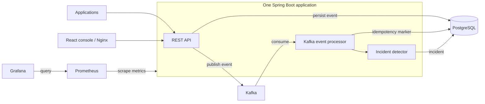

# SignalForge

A distributed event-processing and incident-detection platform built with Java/Spring Boot, Kafka, PostgreSQL, React, Docker, and Prometheus/Grafana. V1 is a single backend application with asynchronous processing, backed by a six-service local stack.

## What SignalForge Does

Applications send telemetry events ? the API persists and publishes them ? a Kafka listener processes them ? rolling-window detection creates incidents ? operators investigate, acknowledge, and resolve incidents. The operations console and metrics dashboard provide visibility.

## Architecture



The API-to-processor relationship is asynchronous through Kafka; no separate processor microservice is deployed. [Architecture and trade-offs](docs/ARCHITECTURE.md).

## Key Engineering Features

- Kafka JSON event processing, durable UUID idempotency markers, bounded retries and dead-letter handling.
- Rolling-window spike detection and OPEN ? ACKNOWLEDGED ? RESOLVED incident lifecycle.
- Paginated, filtered reads, database indexes, local rate limiting, and optimistic locking.
- Prometheus business metrics and a provisioned Grafana dashboard.
- Dockerized backend, frontend, PostgreSQL, Kafka, Prometheus, and Grafana.
- Session authentication, CSRF protection, server-enforced RBAC, delegated access governance, and audit records.
- Responsive React operations console with operational and governance views.

## Access Model

New accounts start with **NO_ACCESS ? VIEWER ? OPERATOR**. VIEWER members approve VIEWER requests; OPERATOR members approve OPERATOR requests. Self-review is forbidden. ADMIN is separately assigned and provides bootstrap, oversight, and intervention. Empty target groups notify ADMIN as a fallback; populated groups notify their own members. No access is granted automatically. [Security](docs/SECURITY.md).

## Tech Stack

| Area | Implementation |
| --- | --- |
| Backend | Java 21, Spring Boot 4.1.1, Spring Data JPA, Spring Kafka, Flyway |
| Frontend | React, TypeScript, Vite, React Router |
| Data / messaging | PostgreSQL 16, Kafka 3.8.1 in single-node KRaft mode |
| Observability | Actuator, Micrometer, Prometheus, Grafana |
| Infrastructure / testing | Docker Compose, Maven wrapper, JUnit/MockMvc, Vitest/Testing Library, Python standard-library validation |

## Quick Start

Install Docker Desktop with Linux containers. From the repository root:

```powershell
docker compose up --build
```

| Service | Local URL |
| --- | --- |
| Application | http://localhost:5173 |
| Backend health | http://localhost:8080/actuator/health |
| Prometheus | http://localhost:9090 |
| Grafana | http://localhost:3000 |

Grafana's published **local-only** default login is `admin` / `admin`; change it before exposing the stack. PostgreSQL also uses public development defaults, not production secrets. Kafka is reachable from the host at `localhost:9092`, PostgreSQL at `localhost:5433`.

No environment file is required to start the stack. Copy [.env.example](.env.example) to `.env` only when configuring optional bootstrap or SMTP. A fresh installation has no application ADMIN: opt-in bootstrap creates a new administrator identity; it refuses to claim an existing non-admin account. Registration does not log you in or grant operational access. See [setup instructions](docs/DEVELOPMENT.md). Never commit real passwords or SMTP credentials.

## API Overview

Paths below are backend paths; the Docker UI exposes them through `/api`.

| Area | Important endpoints |
| --- | --- |
| Authentication | `GET /auth/csrf`, `POST /auth/register`, `POST /auth/login`, `GET /auth/me`, `POST /auth/logout` |
| Events | `POST /events`, `GET /events`, `GET /events/{id}` |
| Incidents | `GET /incidents`, `GET /incidents/{id}`, `PATCH /incidents/{id}/acknowledge`, `PATCH /incidents/{id}/resolve` |
| Access | `POST /access-requests`, `GET /access-requests/me`, `GET /access-requests/review`, request approve/reject |
| Admin | `/admin/users`, `/admin/access-requests`, `/admin/audit` |

[API contracts, permissions, and examples](docs/API.md).

## Testing

```powershell
cd backend
.\mvnw.cmd '-Duser.timezone=Asia/Kolkata' verify
cd ../frontend
npm.cmd ci
npm.cmd run test
npm.cmd run build
cd ..
python -B -m unittest discover -s scripts/validation -p "test_*.py" -v
```

Final release verification passed **199 backend tests, 96 frontend tests, and 10 validation tests**, plus the production build.

Backend integration tests require the configured PostgreSQL/Kafka services. Validation unit tests are distinct from opt-in load/failure experiments. [Development](docs/DEVELOPMENT.md), [measured validation evidence](docs/validation/VALIDATION.md), and [final release verification](docs/RELEASE_VERIFICATION.md).

## Project Structure

```text
backend/          Spring Boot application, tests, Flyway V1?V9
frontend/         React console and behavioral tests
infrastructure/   Prometheus/Grafana provisioning
scripts/validation/  Load/failure tools and unit tests
docs/             Architecture, API, setup, security, evidence, demo
```

## Engineering Trade-offs / V1 Limitations

- PostgreSQL and Kafka writes are not atomic. The SQL insert is flushed before publishing, but transaction commit happens afterward; a transactional outbox is a possible production evolution, not implemented.
- Detector windows/cooldown and the rate limiter are in-memory per backend instance. Restart and horizontal scaling require different state management; late-event handling is partial.
- One local Kafka broker and limited partitioning provide no broker high availability. Kafka storage is container-local and lost on container recreation; PostgreSQL and monitoring use named volumes.
- Sessions are process-local and lost on restart. Local HTTP cookies are not Secure; production requires HTTPS and hardened deployment configuration.
- Notifications are optional, best-effort after commit and depend on external SMTP configuration. No durable mail queue exists.
- Local Docker is not Kubernetes or a production HA deployment. V1 does not claim exactly-once processing, distributed rate limiting, or production throughput. Audit append-only behavior is application-enforced, not tamper-proof storage.

## Screenshots

Capture real screens using the [screenshot checklist](docs/screenshots/README.md): Overview, Events, Incident detail, Access governance, and Grafana. Images are intentionally pending authenticated manual capture; no fabricated screenshots are included.

For a short walkthrough, see the [5?10 minute demo](docs/DEMO.md).
