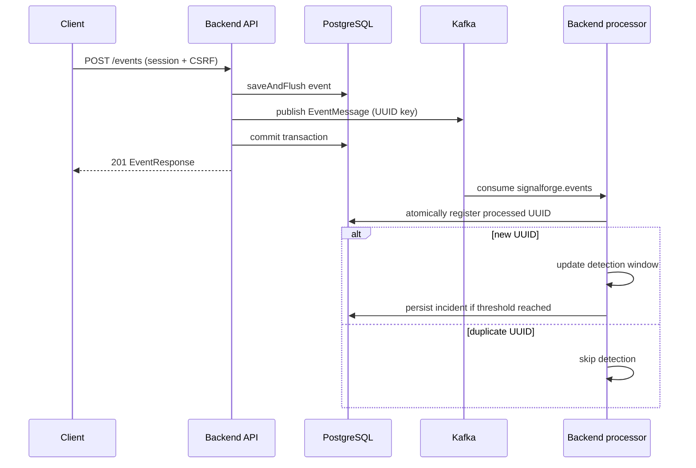

# Architecture

SignalForge deploys one Spring Boot backend, one React/Nginx frontend, PostgreSQL, Kafka, Prometheus, and Grafana. API handlers, Kafka listeners, detection, and governance live in the same backend process.

The diagram shows the intended path; publishing and database commit are independent and consumption can race commit. Publishing failure/commit failure must not be mistaken for atomic delivery.

## Ingestion and processing

Bean Validation checks the request, the per-remote-address limiter allows 10 events per 60-second fixed window, and EventService flushes the SQL insert before calling EventPublisher. Kafka carries a dedicated JSON EventMessage, not a JPA entity. Event IDs are generated by Hibernate; timestamps and backend receivedAt are retained.

The listener uses consumer group `signalforge-event-processors`. Processing inserts a durable UUID marker with conflict-safe registration. The marker and any incident write share a PostgreSQL transaction. A repeated committed UUID skips detection. This provides durable application idempotency, not exactly-once messaging.

The Spring Kafka error handler retries processing twice at one-second intervals, then publishes to `signalforge.events.dlt` partition 0. Failed DLT publishing is not successful recovery. No DLT replay UI or automated replay pipeline exists.

## Incident detection and persistence

Detection groups by `(service, type)` and triggers after three events within a 60-second event-time window. A 60-second cooldown limits repeated incidents per key. Severity is copied into the incident, not used as a threshold filter. Windows and cooldown are synchronized process-local maps. Out-of-order events exclude future timestamps but previously evicted history is not reconstructed. In-memory changes are not rolled back with database transactions.

Incidents progress OPEN ? ACKNOWLEDGED ? RESOLVED, or directly OPEN ? RESOLVED. JPA optimistic locking protects concurrent lifecycle writes; conflicts are returned rather than silently overwriting. PostgreSQL stores events, incidents, processed markers, accounts, requests, and audit facts. Flyway V1?V9 owns schema changes; Hibernate DDL generation is disabled. Filtered lists use bounded pagination, deterministic timestamp/UUID ordering, and migration-defined indexes.

## Authentication and governance

Spring Security manages BCrypt authentication and process-local cookie sessions. Mutations require CSRF. Current roles are reloaded on requests, so an existing session does not retain revoked authority. NO_ACCESS accounts cannot enter operational APIs. VIEWER/OPERATOR membership owns approval of that same requested group; ADMIN can intervene and manage roles/audit. The role-change advisory lock serializes governance mutations, with request state, role grant, and audit facts committed together. Self-review and demoting the last ADMIN are prohibited.

Optional mail runs after request commit. It selects current target-group members, falling back to ADMIN only for an empty group. Mail failures are contained and do not undo requests.

## Metrics and networking

Actuator exposes health and Prometheus metrics. Prometheus scrapes `backend:8080`; Grafana uses `prometheus:9090` through Compose DNS. Counters/rates describe process activity, not authoritative database totals. Restart resets process counters, and inactive grouped series can show No data.

Nginx serves React and proxies browser `/api/*` to `backend:8080/*`, stripping `/api`. Docker backend connects to `postgres:5432` and `kafka:29092`. Host development uses PostgreSQL port 5433 and Kafka's external listener 9092. Host Vite calls backend port 8080 with credentialed CORS for `http://localhost:5173`. Only full Docker mode is covered by the supplied Prometheus scrape configuration.

## Design Decisions and Trade-offs

- One backend keeps V1 approachable while Kafka separates ingestion and asynchronous work without pretending to be a microservice deployment.
- PostgreSQL UUID markers survive consumer/backend restart and coordinate duplicate suppression with incident persistence.
- Simple in-memory windows and rate limits make the algorithm readable, at the cost of restart continuity and multi-instance correctness.
- Bounded retry/DLT isolates poison processing records without claiming end-to-end exactly-once delivery.
- Sessions and server-side RBAC avoid browser token persistence; process-local sessions and local HTTP are development trade-offs.
- Delegated approval shares governance with actual group members while retaining administrator recovery and auditable intervention.
- Named database/monitoring volumes preserve local history. Kafka deliberately remains a single ephemeral local broker. No destructive volume cleanup is part of setup.
- An outbox, shared detector/rate-limit state, durable Kafka storage, shared sessions, HTTPS, and production secret management are possible future work, not implemented features.
