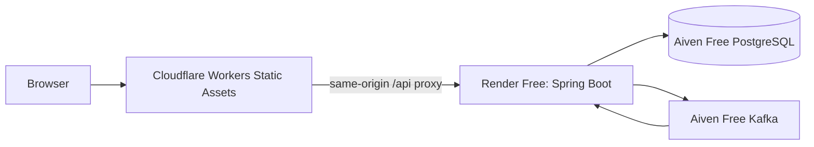

# Public free-tier deployment

SignalForge is deployed at **https://signalforge.ignal-orge.workers.dev**. This is a portfolio environment on provider free tiers, not production infrastructure.

## Architecture



| Component | Provider | Public endpoint / plan |
| --- | --- | --- |
| React application and API proxy | Cloudflare Workers Static Assets | `https://signalforge.ignal-orge.workers.dev`, Free |
| Spring Boot backend | Render | `https://signalforge-api-2uh8.onrender.com`, Free |
| PostgreSQL | Aiven | `signalforge-postgres`, `free-1-1gb` |
| Kafka | Aiven | `kafka-17426b18`, `free-0` |
| Prometheus and Grafana | Local Docker only | Not publicly hosted |
| SMTP | Disabled publicly | Request queues remain functional |

The Worker serves only the compiled `frontend/dist` assets and runs first for `/api/*`. It forwards the method, body, query, cookies, browser Origin, and CSRF header to the fixed HTTPS Render origin. Client-supplied forwarding headers are stripped. `X-Forwarded-Host` and `X-Forwarded-Proto` preserve the public origin, allowing host-only `Secure`, `HttpOnly`, `SameSite=Lax` session cookies to remain first-party. The proxy fails closed for missing/non-HTTPS upstream configuration.

## Repository deployment support

- `frontend/wrangler.jsonc` defines the Worker, SPA fallback, static assets, public backend origin, and disabled preview URLs.
- `frontend/cloud-worker.js` routes only `/api/*` through the proxy and sends other paths to static assets.
- `frontend/functions/api/[[path]].js` implements the constrained proxy.
- `scripts/deployment/proxy.test.mjs` verifies secure upstream validation, CSRF/cookie forwarding, spoofed-header removal, path confinement, and safe failures.
- `backend/src/main/resources/application-cloud.properties` is an opt-in cloud profile. It requires environment values for PostgreSQL, Kafka TLS, and the exact frontend origin; local defaults remain unchanged.
- `render.yaml` is a reusable Free-plan template. Every `sync: false` value must be configured in Render; it contains no credentials.
- `DevelopmentCorsConfig` reads `signalforge.frontend-origin`, defaulting to `http://localhost:5173`, and covers the delegated review endpoints.

The current Render service was initially created from released `main` using equivalent environment configuration because these repository changes were intentionally not pushed during deployment.

## Cloud configuration

Render stores database and Kafka values server-side. Required values are:

- `CLOUD_DATABASE_JDBC_URL`, `CLOUD_DATABASE_USERNAME`, `CLOUD_DATABASE_PASSWORD`
- a PostgreSQL CA secret file referenced by the JDBC URL with `sslmode=verify-full`
- `CLOUD_KAFKA_BOOTSTRAP_SERVERS`
- `CLOUD_KAFKA_CA_CERT`, `CLOUD_KAFKA_CLIENT_CERT`, `CLOUD_KAFKA_CLIENT_KEY`
- `SIGNALFORGE_FRONTEND_ORIGIN=https://signalforge.ignal-orge.workers.dev`

Kafka uses PEM client-certificate authentication over TLS with hostname verification. Topics `signalforge.events` and `signalforge.events.dlt` have two partitions, replication factor two, and 72-hour retention. Topic creation is disabled for cloud startup because the free service was provisioned explicitly.

Cloud PostgreSQL was confirmed empty before Flyway applied V1?V9. Local records were never copied. Hikari is capped at five connections against Aiven Free's 20-connection limit.

The intended owner was bootstrapped once and verified as the sole ADMIN. Bootstrap was then disabled, the Render bootstrap-password variable was deleted, and the temporary local password file was removed. Never leave bootstrap enabled after successful creation.

## Deployment commands

After installing Wrangler and authenticating to the intended free account:

```powershell
cd frontend
$env:VITE_API_BASE_URL='/api'
npm.cmd ci
npm.cmd run test
npm.cmd run build
node --test ../scripts/deployment/proxy.test.mjs
npm.cmd exec -- wrangler deploy --config wrangler.jsonc
```

Create or update the Render service from `render.yaml` only after configuring every required provider secret. Do not put provider tokens, database passwords, private keys, or bootstrap passwords in Git, `.env.example`, command-line arguments, or frontend variables.

## Verified behavior

Actual public verification completed:

- HTTPS application and direct SPA routes `/`, `/login`, `/register`, `/events`, `/incidents`, and `/access` returned 200.
- `/api/actuator/health` returned 200 with status `UP`.
- Registration created a `NO_ACCESS` account.
- Login, secure session restoration, fresh-CSRF mutation, PENDING VIEWER request creation, own-request reload, logout, and subsequent 401 were verified.
- The isolated verification account, request, and related audit facts were then removed by exact recorded IDs.
- PostgreSQL TLS `verify-full`, Flyway V1?V9, and empty initial application tables were verified.
- Kafka certificate authentication, hostname verification, and both topic descriptions were verified.
- The intended owner was verified as the sole cloud ADMIN; bootstrap is disabled and its password is absent from Render.
- Local regression baseline: 199 backend tests, 96 frontend tests, 10 validation tests, production build, Compose configuration, and four proxy tests passed.

Authenticated operational event ingestion, Kafka consumption, incident generation/lifecycle, and the ADMIN governance UI remain a manual owner walkthrough because the deployment password was deliberately not retained. Real SMTP delivery also remains manual/unconfigured. These checks are not claimed as complete.

## Free-tier limits

- Render Free sleeps after 15 minutes without inbound traffic; waking can take about a minute. Its filesystem is ephemeral and process-local sessions/detection/rate-limit state reset on restart.
- Aiven Free services can be powered off after inactivity and are not covered by an SLA. PostgreSQL is a single node with 1 GB storage and 20 connections.
- Aiven Kafka Free is limited to 250 KiB/s ingress/egress, five topics, two partitions per topic, and short retention.
- Cloudflare Worker proxy invocations count toward the Workers Free quota; static assets follow Cloudflare's static-asset limits.
- Public Prometheus/Grafana and SMTP are intentionally omitted. The six-service local Compose stack retains full observability.

Official references: [Render Free](https://render.com/docs/free), [Aiven PostgreSQL Free](https://aiven.io/docs/products/postgresql/concepts/pg-free-tier), [Aiven Kafka Free](https://aiven.io/docs/products/kafka/free-tier/kafka-free-tier), and [Cloudflare static-assets billing](https://developers.cloudflare.com/workers/static-assets/billing-and-limitations/).

## Credential cleanup

Temporary local Aiven, Render, Kafka, database, and bootstrap payloads were stored only under ignored `backend/target` paths and deleted after deployment. Aiven and Cloudflare CLI sessions were logged out. No provider secret is present in repository files. Revoke the temporary `SignalForge deployment` Render API key from Render Account Settings after deployment maintenance is complete.
